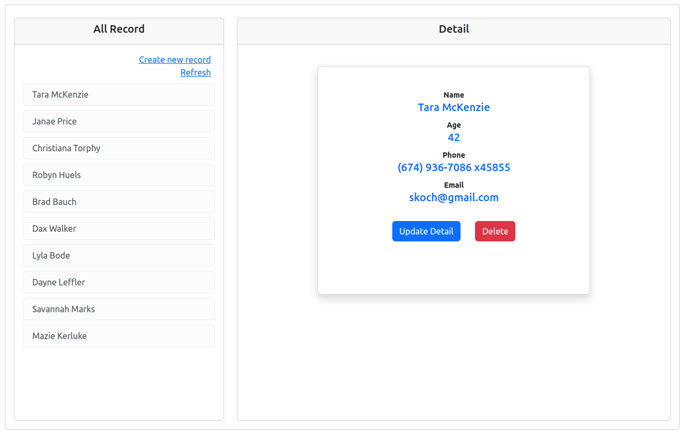
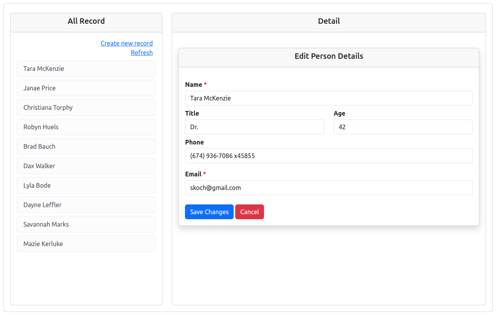

## About

- Implemented CRUD Api
- Used RSpec to write tests
- Demonstrated use of Hotwire

#### Prerequisites

- ruby 3.2.2
- rails 7.0.8
- Node 18+, and Yarn 1.x

#### Install

##### 1. Check out the repository

```bash
git clone https://github.com/ravendra-01/todo-list-app.git
```

##### 3. Create and setup the database

Run the following commands to install gems.

```ruby
bundle install
```

##### 2. Create and setup the database

Run the following commands to create and setup the database.

```ruby
rails db:create db:migrate db:seed
```

##### 4. Start the Rails server

You can start the rails server using the command given below.

```ruby
rails s
```

And now you can visit the site with the URL http://localhost:3000

#### Features

Implemented CRUD [api](https://api.postman.com/collections/18613790-b18019d8-67e3-4350-add1-e4917fd67acc?access_key=PMAT-01HQ075FBT05JGJ7CCD3QPAK85) for people controller.

- Screenshots


